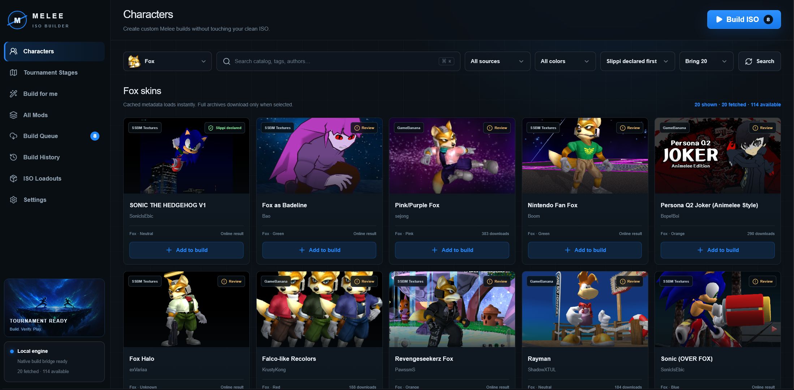

# Melee ISO Builder

Aplicación para Windows que permite buscar skins de personajes y escenarios,
preparar una selección y crear una nueva ISO personalizada de Super Smash Bros.
Melee. La ISO limpia original nunca se modifica.

## Descargar

- [Instalador para Windows](https://github.com/DplNegan/Melee-ISO-Builder-Releases/releases/download/v1.1.3/Melee-ISO-Builder-Setup-1.1.3.exe)
- [Versión portable](https://github.com/DplNegan/Melee-ISO-Builder-Releases/releases/download/v1.1.3/Melee-ISO-Builder-Portable-win-x64-1.1.3.zip)

El instalador es la opción recomendada. La versión portable debe descomprimirse
completa antes de abrir `MeleeISOBuilder.exe`.

## Primer inicio

La primera vez que abras la aplicación te pedirá solamente:

1. La ubicación de tu ISO limpia de Melee.
2. La carpeta donde quieres guardar las nuevas ISOs.

Estas rutas quedan guardadas. Si deseas cambiarlas después, abre **Settings**.

## Cómo usarla

1. Abre **Characters** o **Tournament Stages**.
2. Selecciona el personaje o escenario.
3. Pulsa **Search** para buscar mods. En versiones anteriores este botón se
   llamaba **Sync**.
4. Agrega los mods deseados con **Add to build**.
5. Revisa la selección en **Build Queue**.
6. Pulsa **Build ISO** y espera a que finalice.
7. Consulta **Build History** o **ISO Loadouts** para ver qué se aplicó.

## Modificar una ISO creada

1. Abre **ISO Loadouts** y selecciona una ISO terminada.
2. Pulsa **Modify this ISO**.
3. Agrega o reemplaza los skins y escenarios que quieras.
4. Pulsa **Build ISO** para guardar una ISO nueva.

La ISO seleccionada se usa como base y nunca se sobrescribe. En el historial
puedes distinguir los cambios heredados de los nuevos y ver cuáles se
reemplazaron.

## Requisitos

- Windows 10 u 11 de 64 bits.
- Tu propia ISO limpia de Super Smash Bros. Melee.
- Conexión a Internet para buscar y descargar mods.
- Espacio disponible para la ISO generada.

## Importante

- Este repositorio no incluye el juego ni ninguna ISO.
- La aplicación nunca modifica la ISO limpia seleccionada.
- Algunos mods pueden no incluir una imagen para la pantalla de selección.
- La etiqueta **Slippi declared** utiliza la compatibilidad informada por el
  autor del mod.
